<p align="center">
  <picture>
    <source media="(prefers-color-scheme: dark)" srcset="logo-light.svg">
    
  </picture>
</p>

<h1 align="center">Terminal user interfaces for PHP</h1>

<div align="center">

[](https://github.com/drevops/phptui/issues)
[](https://github.com/drevops/phptui/pulls)
[](https://github.com/drevops/phptui/actions/workflows/test-php.yml)
[](https://codecov.io/gh/drevops/phptui)


</div>

---

<p align="center">
  <picture>
    <source media="(prefers-color-scheme: dark)" srcset="docs/assets/bordered-panels-dark-animated.svg">
    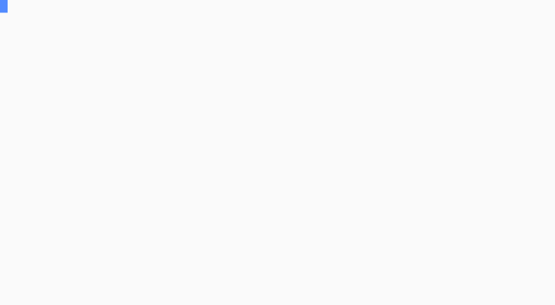
  </picture>
</p>

`drevops/phptui` is a PHP library for panel-based terminal forms: keyboard-driven questionnaires that collect a set of answers and hand them back to your code as typed values.

- **Declarative form model.** A form is declared with a fluent builder (`Form` / `PanelBuilder` / `FieldBuilder`): panels of typed fields, each with its own options, conditions, derivation rules and behavior.
- **Two collection modes, one declaration.** The same form runs as a full-screen interactive TUI on a terminal, or resolves non-interactively from a JSON payload, per-field environment variables, discovery rules and defaults.
- **Application-agnostic.** The library doesn't know (or care) what application it serves; questions and handlers live in your code, and applying the collected answers is your job. It collects; you apply.
- **Dependency-light.** The runtime dependency surface is a single string-transform package.

The padded rounded border above is the default look. The same form explicitly opted out of the frame (`border` `none`, `normal` spacing):

<p align="center">
  <picture>
    <source media="(prefers-color-scheme: dark)" srcset="docs/assets/borderless-panels-dark-animated.svg">
    
  </picture>
</p>

## 📖 Documentation

Full documentation lives at **[phptui.dev](https://phptui.dev)**. The in-development build, rebuilt from `main` ahead of each release, is previewed at **[phptui-docs.netlify.app](https://phptui-docs.netlify.app/)**.

## Features

Every feature has a reference page and a runnable, self-contained example in [`playground/`](playground):

- 🧭 **Full-screen TUI** · [docs](https://phptui.dev/panels) · [`03-panels-*`](playground)<br>
  Show the whole questionnaire at once rather than one question at a time. People can look ahead, move between sections and revise an earlier answer without starting over, and the keys that work right now are always on screen.

- 🪟 **Modal panels** · [docs](https://phptui.dev/panels#modal-panels) · [`03-panels-*`](playground)<br>
  A side question opens as a dialog over the form and closes again, so a detour never costs the reader their place. Cancelling puts back what they started with.

- 🧱 **Panel grids** · [docs](https://phptui.dev/panels#panel-layouts) · [`03-panels-*`](playground)<br>
  Deal sections side by side instead of stacking them, so a long form fits on one screen and its shape is clear at a glance.

- 🗺️ **Layouts** · [docs](https://phptui.dev/layouts) · [`20-layouts-*`](playground)<br>
  Decide where things sit: columns, a header, a footer, borders, and content of your own beside the questions. One layout can be reused by every form you write.

- 🖥️ **Fullscreen mode** · [docs](https://phptui.dev/panels#fullscreen) · [`03-panels-*`](playground)<br>
  Fill the terminal or hug the content, whichever suits. The form stays readable in a cramped window and doesn't sprawl across a very wide one.

- ⚡ **Inline editing** · [docs](https://phptui.dev/panels#inline-editing) · [`04-inline-editing`](playground/04-inline-editing.php)<br>
  Answering happens on the row itself, so the rest of the form stays visible while someone types and the context for a question never disappears.

- 🧩 **Fields** · [docs](https://phptui.dev/fields) · [`02-fields-*`](playground)<br>
  Fifteen kinds of question, from plain text to dates, ratings, file browsing and fuzzy search, so you rarely have to build an input yourself.

- 🏗️ **Builder-driven** · [docs](https://phptui.dev/configuration) · [`01-quickstart`](playground/01-quickstart.php)<br>
  Declare the form in a few lines of PHP. The common cases need no code beyond naming the questions.

- 🎛️ **Interactive or unattended** · [docs](https://phptui.dev/headless-collection) · [`08-headless-*`](playground)<br>
  The same form serves a person at a terminal and a CI job with no terminal at all, so you write it once instead of maintaining a second, silent path through it.

- 🔗 **Derived values** · [docs](https://phptui.dev/configuration#derived-values) · [`05-form-logic-*`](playground)<br>
  One answer fills in another automatically, so nobody types the same thing twice and the two can never disagree.

- 🔀 **Conditional fields** · [docs](https://phptui.dev/configuration#conditional-fields) · [`05-form-logic-*`](playground)<br>
  Questions appear only when earlier answers make them relevant, keeping the form as short as the situation allows.

- ⚙️ **Declared behavior** · [docs](https://phptui.dev/field-behaviour) · [`06-field-behaviour-*`](playground)<br>
  Say what an answer has to look like and the form enforces it, catching a mistake while the person is still there to correct it.

- 🔍 **Discovery** · [docs](https://phptui.dev/field-behaviour#discovery) · [`07-discovery`](playground/07-discovery.php)<br>
  Run it again on an existing project and the answers arrive pre-filled from what is already there, turning an update into a review rather than a re-entry.

- ⏳ **Progress** · [docs](https://phptui.dev/progress) · [`15-progress-*`](playground)<br>
  Slow work shows a spinner or a bar instead of a still cursor, and quietly becomes a plain line when the output is piped somewhere nobody is watching.

- 🎯 **Answer-driven options** · [docs](https://phptui.dev/field-behaviour#options-from-the-answers) · [`19-dynamic-options`](playground/19-dynamic-options.php)<br>
  A choice narrows itself from what has already been answered, so nobody is offered something that cannot apply to them.

- 🌐 **Remote-backed options** · [docs](https://phptui.dev/progress#options-from-a-query) · [`17-query-options`](playground/17-query-options.php)<br>
  Offer choices from a live source as the reader types, without a request on every keystroke or a frozen screen while one runs.

- 🧾 **Output** · [docs](https://phptui.dev/output) · [`18-output-*`](playground)<br>
  The writing around the form - headings, tables, status lines, a banner - drawn in the same style, so your program reads as one piece rather than a form bolted onto plain print statements.

- 📦 **Self-describing answers** · [docs](https://phptui.dev/headless-collection#self-describing-answers) · [`08-headless-*`](playground)<br>
  Answers come back knowing where each one came from, ready to show as a summary a person can check or hand to another program as JSON.

- 🎨 **Themes** · [docs](https://phptui.dev/themes) · [`09-themes-*`](playground)<br>
  Six looks out of the box, or your own in a few lines. Nothing about the questions changes when the palette does.

- ⌨️ **Key bindings** · [docs](https://phptui.dev/key-bindings) · [`10-key-bindings-*`](playground)<br>
  Arrow keys by default, vim keys if your users prefer them, or a scheme of your own. A clash is reported at startup rather than discovered mid-form.

- ✨ **Display modes** · [docs](https://phptui.dev/display-modes) · [`11-display-modes-*`](playground)<br>
  Adapts to the terminal it finds - dark or light, Unicode or ASCII, color or none - so it looks right without anyone configuring it.

- 🧪 **Test harness** · [docs](https://phptui.dev/testing) · [`13-testing`](playground/13-testing.php)<br>
  Drive a whole form from a script and assert on what it collected and what it drew, with no terminal involved, so form logic is testable in CI.

- 🌍 **Translations** · [docs](https://phptui.dev/translations) · [`12-translations`](playground/12-translations.php)<br>
  Present the form in another language. The built-in wording is already translated, so you only supply your own questions.

## Installation

```bash
composer require drevops/phptui
```

## Quick start

Declare a form with the `Form` builder, then drive it through the `Tui` facade - the one class that wires up collection, the input resolver, the schema tools and the interactive screen for you:

```php
use DrevOps\PhpTui\Builder\Form;
use DrevOps\PhpTui\Builder\PanelBuilder;
use DrevOps\PhpTui\Tui;

$form = Form::create('Quick start')
  ->panel('order', 'New order', function (PanelBuilder $p): void {
    // A required single-line text field.
    $p->text('name', 'Order name')->required();

    // A single choice, starting on "Banana".
    $p->select('fruit', 'Fruit')->default('banana')->options([
      'apple' => 'Apple',
      'banana' => 'Banana',
      'cherry' => 'Cherry',
    ]);

    // A multi-select, with one option pre-checked.
    $p->select('veg', 'Vegetables')->multiple()->default(['carrot'])->options([
      'carrot' => 'Carrot',
      'tomato' => 'Tomato',
      'spinach' => 'Spinach',
    ]);

    // An integer bounded to a sensible quantity.
    $p->number('quantity', 'Quantity')->min(1)->max(99)->default(6);

    // A yes/no gate.
    $p->confirm('organic', 'Organic only?')->default(FALSE);
  });

$tui = new Tui($form, handler_namespaces: ['App\\Handler']);

$answers = $tui->run();
```

The facade's surface:

| Call | Purpose |
|---|---|
| `run($prompts, $version, $directory, $interactive, $update)` | Collect answers; interactive on a TTY, headless otherwise (or forced via `$interactive`) |
| `collect($prompts, $directory, $update, $version)` | Headless collection from JSON + environment; `$update` enables discovery |
| `interact()` | The interactive panel TUI, explicitly |
| `progress($total, $caption, $work)` | Show slow work running around the form: a spinner with no total, a determinate bar with one - a theme-drawn primitive |
| `output()` | Draw the chrome around the form: boxes and cards, tables, status lines, definition lists, text, rules and a banner - theme-drawn primitives |
| `schema()` / `validate($answers)` / `agentHelp()` | Describe the questions as structured metadata, validate an answer payload, emit the agent-facing answer schema |
| `theme($theme, $options)` | Select the theme by name or class, or pass a closure to patch individual elements |
| `layout($layout)` / `keys($preset, $overrides)` | Arrange the screen into named regions; select the key bindings |
| `color($bool)` / `unicode($bool)` / `markdown($bool)` / `fullscreen($bool)` / `footer($bool)` / `clearOnExit($bool)` / `translator($t)` | Display and runtime switches |
| `root()` / `registry()` | The declared block tree, and the handler registry - for finer control |

Read the [full guide at phptui.dev](https://phptui.dev), and browse [`playground/`](playground) for complete, runnable examples - the numbered scripts for each feature listed above.

## Core concepts

A screen is built from four levels, and each owns a fixed set of capabilities. When something does not obviously fit, the question is never "where does this go" but **which level owns the capability it needs**.

```
Screen        the root; occupies the terminal, or fits its contents
└─ Layout     arranges; reusable by name; scrolls what it stacks
   └─ Region  holds blocks and flows them; declares whether it scrolls and whether it draws edges
      └─ Block   drawn in a region
```

One kind of block - a **panel** - contains a layout, which starts the chain again. That is where depth comes from, rather than from a fifth level. Seven kinds of block exist: `Panel`, `Field`, `Markup`, `Breadcrumb`, `Legend`, `Actions` and `Progress`. Only a field collects, so only a field reaches the answers; everything else shows, focuses or activates.

Three things follow, and they are what the rest of the library is shaped by:

- **One tree.** The builder writes blocks directly, so `$form->root()` is what the interactive screen draws, what the headless collector reads, and what the JSON schema describes.
- **Blocks say what they can do.** Each declares its capabilities as interfaces, so a driver asks "does this bind keys, does it collect" rather than "which class is this".
- **Themes say how it looks.** A block asks the theme for one **element** at a time and hands it a plain string; order and spacing belong to the block, color and glyph to the theme.

The whole model is written out at **[phptui.dev/specification](https://phptui.dev/specification)**.

## Fields

There's a field for most things you'd want to ask: text entry, numbers and dates, single and multiple choice, fuzzy search, filesystem browsing, and simple gates. Each heading links to its full reference on [phptui.dev](https://phptui.dev/fields), and every demo below plays back the real interaction in whichever color scheme - light or dark - your reader is using.

### [Calendar](https://phptui.dev/fields/calendar)

A month calendar returning a normalized ISO `YYYY-MM-DD`; arrows move by day and week.

<p align="center">
  <picture>
    <source media="(prefers-color-scheme: dark)" srcset="docs/assets/field-calendar-dark-animated.svg">
    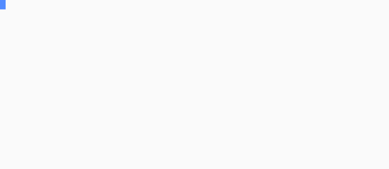
  </picture>
</p>

### [Confirm](https://phptui.dev/fields/confirm)

Yes/No toggle; arrows or <kbd>Space</kbd> switch, <kbd>y</kbd>/<kbd>n</kbd> set the choice directly, <kbd>Enter</kbd> accepts.

<p align="center">
  <picture>
    <source media="(prefers-color-scheme: dark)" srcset="docs/assets/field-confirm-dark-animated.svg">
    
  </picture>
</p>

### [File picker](https://phptui.dev/fields/filepicker)

Browse the filesystem for a path; arrows move, <kbd>→</kbd> enters a directory and <kbd>←</kbd> returns to its parent. Add `->multiple()` for several paths.

<p align="center">
  <picture>
    <source media="(prefers-color-scheme: dark)" srcset="docs/assets/field-filepicker-dark-animated.svg">
    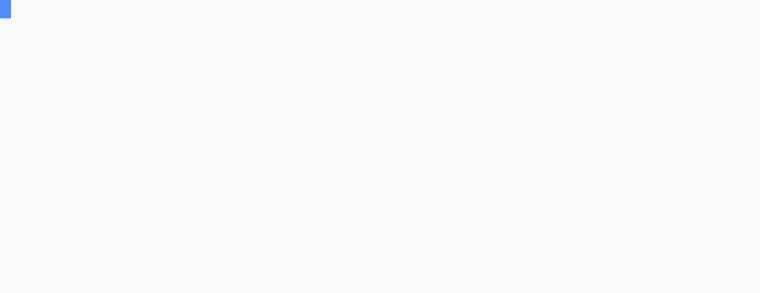
  </picture>
</p>

### [Number](https://phptui.dev/fields/number)

Integer entry (digits with an optional leading minus) accepted as an `int`, with optional min, max and step.

<p align="center">
  <picture>
    <source media="(prefers-color-scheme: dark)" srcset="docs/assets/field-number-dark-animated.svg">
    
  </picture>
</p>

### [Password](https://phptui.dev/fields/password)

Text rendered as a mask in the editor, the field row and the summary; the accepted value stays plain for your code, and can be made revealable.

<p align="center">
  <picture>
    <source media="(prefers-color-scheme: dark)" srcset="docs/assets/field-password-dark-animated.svg">
    
  </picture>
</p>

### [Pause](https://phptui.dev/fields/pause)

An acknowledgment gate; <kbd>Enter</kbd> or <kbd>Space</kbd> accepts. Unattended runs auto-acknowledge it, so it never blocks automation.

<p align="center">
  <picture>
    <source media="(prefers-color-scheme: dark)" srcset="docs/assets/field-pause-dark-animated.svg">
    
  </picture>
</p>

### [Progress](https://phptui.dev/progress-row)

A panel row that runs its work when activated, filling a bar or ticking a spinner in the row itself; it collects no value.

<p align="center">
  <picture>
    <source media="(prefers-color-scheme: dark)" srcset="docs/assets/progress-row-dark-animated.svg">
    
  </picture>
</p>

### [Rating](https://phptui.dev/fields/rating)

A graded answer picked from a scale of points, accepted as an `int`; arrows walk the scale, a digit jumps to its point, and each point can carry a caption.

<p align="center">
  <picture>
    <source media="(prefers-color-scheme: dark)" srcset="docs/assets/field-rating-dark-animated.svg">
    
  </picture>
</p>

### [Reorder](https://phptui.dev/fields/reorder)

Rank a list by moving items into the order you want; <kbd>Space</kbd> picks an item up, arrows carry it through the list, <kbd>Enter</kbd> accepts.

<p align="center">
  <picture>
    <source media="(prefers-color-scheme: dark)" srcset="docs/assets/field-reorder-dark-animated.svg">
    
  </picture>
</p>

### [Search](https://phptui.dev/fields/search)

Single choice with a visible filter line; typing fuzzy-matches and ranks the labels, exact and prefix matches leading.

<p align="center">
  <picture>
    <source media="(prefers-color-scheme: dark)" srcset="docs/assets/field-search-dark-animated.svg">
    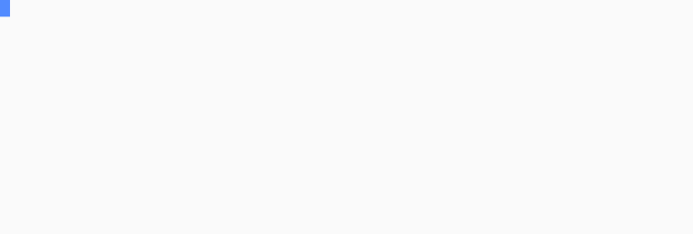
  </picture>
</p>

### [Select](https://phptui.dev/fields/select)

Single choice from a list; arrows move, <kbd>Enter</kbd> accepts the highlighted option, long lists page around the cursor.

<p align="center">
  <picture>
    <source media="(prefers-color-scheme: dark)" srcset="docs/assets/field-select-dark-animated.svg">
    
  </picture>
</p>

### [Suggest](https://phptui.dev/fields/suggest)

Free text with autocomplete over a fixed option set: as you type, suggestions are fuzzy-matched and ranked by relevance.

<p align="center">
  <picture>
    <source media="(prefers-color-scheme: dark)" srcset="docs/assets/field-suggest-dark-animated.svg">
    
  </picture>
</p>

### [Template](https://phptui.dev/fields/template)

Fill the named slots of a fixed shape; the fixed text is context, <kbd>Tab</kbd> steps between slots and each one validates on its own.

<p align="center">
  <picture>
    <source media="(prefers-color-scheme: dark)" srcset="docs/assets/field-template-dark-animated.svg">
    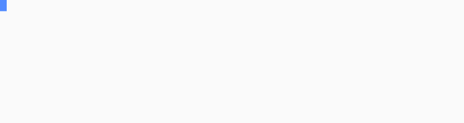
  </picture>
</p>

### [Text](https://phptui.dev/fields/text)

Single-line input with a movable caret; type to insert, arrows move, <kbd>Backspace</kbd> deletes, <kbd>Enter</kbd> accepts.

<p align="center">
  <picture>
    <source media="(prefers-color-scheme: dark)" srcset="docs/assets/field-text-dark-animated.svg">
    
  </picture>
</p>

### [Textarea](https://phptui.dev/fields/textarea)

Multi-line input; <kbd>Enter</kbd> inserts a newline, arrows move between lines, <kbd>Tab</kbd> accepts, with an external-editor handoff.

<p align="center">
  <picture>
    <source media="(prefers-color-scheme: dark)" srcset="docs/assets/field-textarea-dark-animated.svg">
    
  </picture>
</p>

### [Toggle](https://phptui.dev/fields/toggle)

An inline switch between two labeled values; arrows or <kbd>Space</kbd> flip, the first letter of each label sets it directly.

<p align="center">
  <picture>
    <source media="(prefers-color-scheme: dark)" srcset="docs/assets/field-toggle-dark-animated.svg">
    
  </picture>
</p>

## Themes

Six themes ship built-in, selected by name on the `Tui` facade. Dark or light is a separate `mode` display option auto-detected from the terminal background, so every adaptive theme serves both:

```php
$tui = (new Tui($form))->theme('midnight');
```

Each renders across every field and degrades to plain text without ANSI. Below, the dark palette is on the left and the light palette on the right; the [themes docs](https://phptui.dev/themes) also show every theme inside the rounded border frame.

### `default`

Cyan accents on an auto-detected dark or light base - the out-of-the-box look. It carries no preview of its own because it needs none: every recording on this page, from the two demos at the top to all sixteen fields above, is drawn in it.

### `midnight`

Violet accents, green values, pink highlights.

<p>
  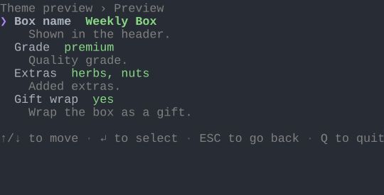
  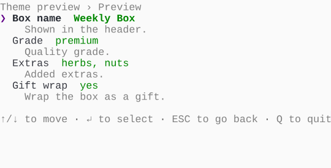
</p>

### `frost`

Arctic frost-blue accents, sage values, sand highlights.

<p>
  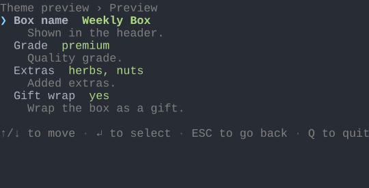
  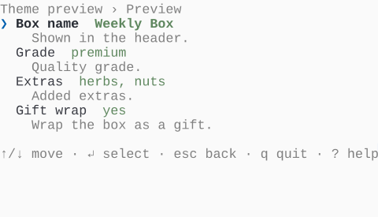
</p>

### `ember`

Burnt-orange accents, olive values, gold highlights.

<p>
  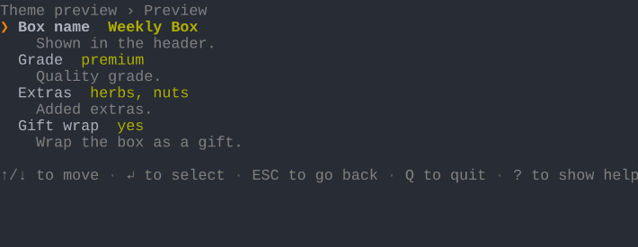
  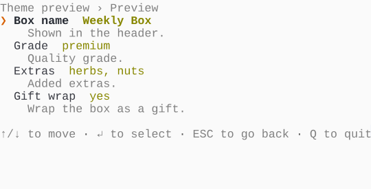
</p>

### `mono`

Hue-free - bold weight, gray levels and reverse video for maximum compatibility.

<p>
  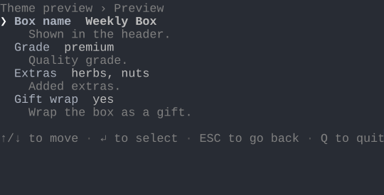
  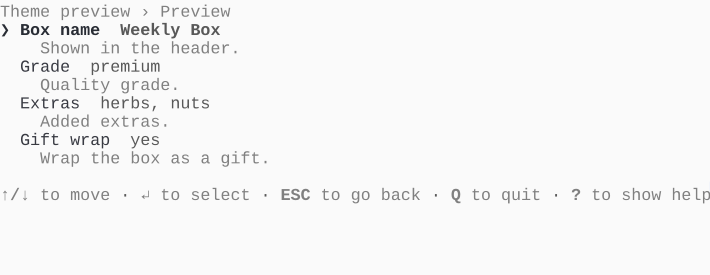
</p>

### `dos`

Retro MS-DOS: the bright white/cyan/yellow CGA palette in a double-line window, painted on its own blue screen regardless of the terminal background.

<p>
  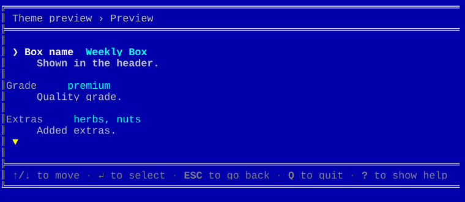
  
</p>

Write your own by subclassing `DefaultTheme` and repainting just the voices a palette needs - see the [theming guide](https://phptui.dev/themes) and the playground's [`OceanTheme`](playground/themes/OceanTheme.php). To change a handful of glyphs and nothing else, skip the class: `->theme(fn(ThemeBuilder $t) => $t->field(fn(FieldOverrides $f) => $f->selector('▶', '=>')))` patches the selected theme in place, and anything it does not name keeps that theme's own answer.

## Contributing

See the [Contributing guide](https://phptui-docs.netlify.app/contributing) for the development workflow, quality gates and how the documentation and SVG assets are built.

---
_This repository was created using the [Scaffold](https://getscaffold.dev/) project template_
