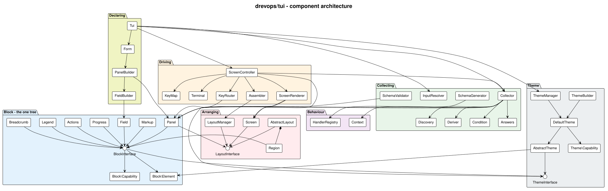
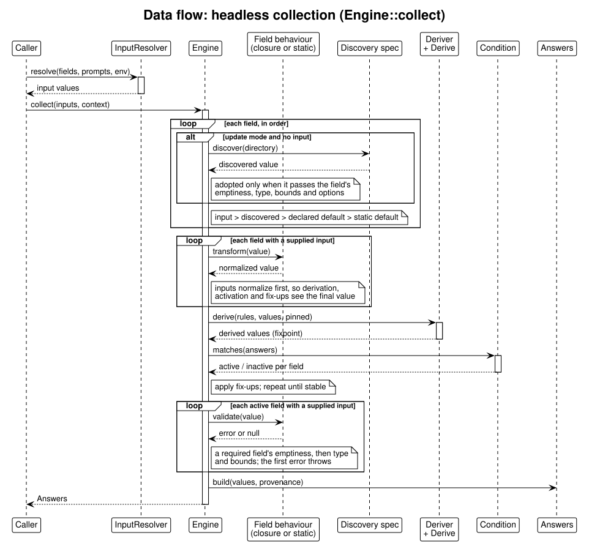
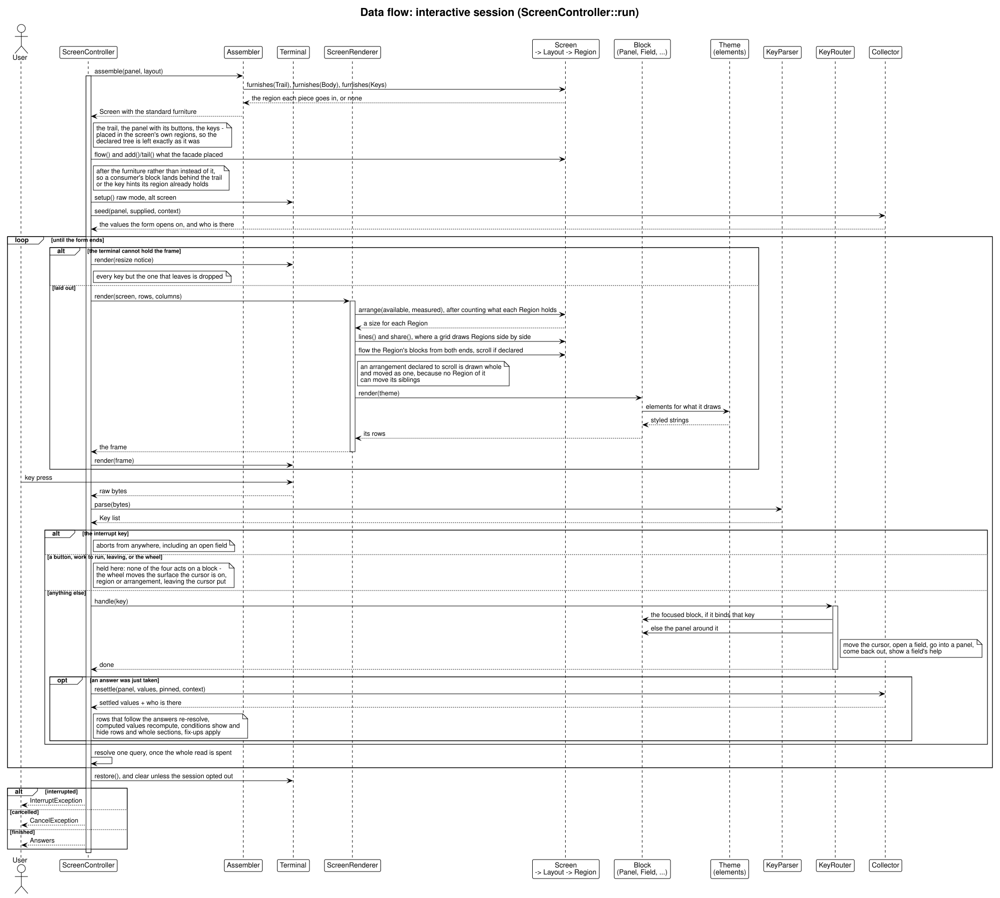

# How the TUI works

This is a walkthrough of the `drevops/tui` library - what you assemble to build a form, and what happens when it runs. The diagrams are rendered from the PlantUML sources in this directory by the [`render-tui-diagrams`](../../.claude/skills/render-tui-diagrams/SKILL.md) skill; everything below is derived from `src/`, so if the prose and the code disagree, the code wins.

The model the whole library is built on - four levels, seventeen capabilities, one canonical tree - is written out on the [specification](https://phptui.dev/specification) page. This walkthrough is the same thing seen from the outside: which class does which part, and in what order.

## The shape of it

At the center is the **block tree**. A form is declared as one, and everything else either writes into it (the builders), reads it (the collector, the schema tools) or draws it (the screen and its theme).

<picture>
  <source media="(prefers-color-scheme: dark)" srcset="architecture-dark.svg">
  
</picture>

Read it as three concerns around that tree:

- **Declaring.** `Form`, `PanelBuilder` and `FieldBuilder` write the tree; `Tui` is the facade a consumer holds. Every runtime switch that describes the terminal rather than the questionnaire - the theme, the layout, the key bindings, color, Unicode, the footer - is set on the facade, so one declaration serves every way of running it.
- **The tree itself.** `Panel`, `Field`, `Markup`, `Breadcrumb`, `Legend`, `Actions` and `Progress` all implement `BlockInterface`, and each declares what it can do as a capability interface (`Block\Capability`) and what it needs drawn as an elements interface (`Block\Element`). `Tree` is the one walk of it, so the collector, the screen and the schema tools read one order and one answer to which blocks are there.
- **Running it.** `Collector` collects the tree with no screen at all. `ScreenController` drives it through a terminal, arranging it with a `Screen`, a layout and its regions, sending each key inward with `KeyRouter` and drawing outward with `ScreenRenderer`. Both paths settle the same rules and produce the same `Answers`.

Under all three sits the terminal. `Terminal` is the device - raw mode, the alternate screen, the size it reports - and beside it is the text machinery every drawn line passes through: `Ansi` for escape sequences, `Box` and `Table` for the geometry of a frame and a grid, and `Terminal\Markup` - distinct from the `Markup` block above - for the markdown subset. All of it takes plain strings and hands plain strings back, so nothing above it has to know how a glyph reaches the screen.

## Step 1 - describe the questions

You declare the questions in PHP with the fluent `Form` builder: panels holding fields. A field has an `id`, a type (`text`, `select`, `suggest`, `search`, `filepicker`, `confirm` and the rest; `select`, `search` and `filepicker` collect a list with `->multiple()`) and optional rules - `default`, `required`, `options`, `when` (show it only when a condition holds), `derive` (compute it from other fields) and `discover` (detect it from the target directory).

What the builder produces is not a separate model: it writes the block tree directly. `$form->root()` hands back the root `Panel`, its regions hold the blocks, and a sub-panel is a block in a region like any other. There is one tree, and every operation on the facade reads that one - collection, the interactive session, the JSON schema, the validator. The declaration is checked as it is written: anything a single call can decide throws at that call - an unknown layout name, a setter on a kind that has nothing to set it on - and anything only the finished tree can decide throws when the form is built: duplicate field ids, an unknown transform name, a modal declaring sub-panels. Either way it lands before a session starts rather than mid-session.

Nothing runs yet; this is pure description.

## Step 2 - attach behavior where you need it

Most fields need no code at all. When one does - a dynamic default, discovery, validation or a normalization - declare it on the field itself: `->default(fn ...)`, `->validate(fn ...)`, `->transform(fn ...)`, `->discover(...)`. Reusable validators and transformers are public static methods on a consumer class named after the field id (`red_apple` -> `RedApple`) in a registered namespace - referenced explicitly as first-class callables, or resolved through the `HandlerRegistry` as the fallback. When both exist, the field declaration wins.

## Step 3 - collect the answers

`Tui::collect()` turns the tree plus whatever the caller supplied into a settled set of answers, with no screen anywhere:

<picture>
  <source media="(prefers-color-scheme: dark)" srcset="dataflow-collect-dark.svg">
  
</picture>

Four capabilities survive here and thirteen do not, and the line between them is the useful part: collecting, constraining, refusing and depending on another answer are the form's meaning; the rest is how it looks. No `Screen`, no layout and no `Region` is built, and neither is any block that only shows.

Walking the sequence:

1. **Resolve each field's starting value**, in priority order: an explicit input (from a JSON payload or the environment, through `InputResolver`) beats a discovered value (in update mode, adopted only when it passes the field's emptiness, type, bounds and rows), which beats a dynamic default, which beats the static one.
2. **Normalize each supplied value** through its declared or resolved transform, so derivation, conditions and fix-ups all see the final value. Defaults and derived values are the form's own and skip the transformers.
3. **Settle.** `Deriver` recomputes `derive` values until they stop changing, one `Tree::within()` walk decides which blocks are there at all - a section carrying whatever it holds - rows that follow the answers re-resolve, and fix-ups reconcile dependents, repeated until nothing moves.
4. **Measure each supplied value** that survived: emptiness on a required field first, then type, bounds and rows. A value the form refuses raises `CollectException` naming the field and the reason, because with no screen there is nobody to retype it.
5. **Emit `Answers`** - the values plus their provenance (default, detected, edited, derived, override).

Only supplied values are measured, and only once the set has settled, because until then there is nothing final to measure them against.

## Step 4 - let a person answer (optional)

For interactive use, `ScreenController::run()` seeds itself from the same collector and drives a terminal session until the form ends:

<picture>
  <source media="(prefers-color-scheme: dark)" srcset="dataflow-tui-dark.svg">
  
</picture>

**Assembling.** `Assembler` builds a `Screen` around the panel and asks the layout, one `Furniture` role at a time, which of its regions each piece belongs in: the trail, the form itself with its `Actions`, and the keys. `AbstractLayout` answers with the conventional `header`, `content` and `footer`, so a layout using those names is furnished without writing a line, and one calling its regions something else overrides `furnishes()` and says where each piece goes. A piece it answers `NULL` for is never drawn; only the form itself has to be answered, and a layout with nowhere for it is refused where it is named. Everything placed goes into the screen's own regions, never into the panel tree, so a second run over the same declaration opens on the same first frame. The layout itself comes from `LayoutManager`, by shipped name, by a name a consumer registered, or by the class itself.

**Drawing runs outward.** The `Screen` gives its layout the terminal; `ScreenRenderer` counts what each region holds and hands the layout the numbers; `AbstractLayout` takes the sized regions off the top - the fixed ones and the measured ones alike - and divides the remainder by the declared shares; each `Region` flows its blocks and scrolls them if it was declared to, and an arrangement declared to scroll moves every line of itself at once; each block's `render()` reaches the theme for elements; the theme returns styled strings. Every step hands down exactly one thing and knows nothing of the step after it, and nothing reaches back up.

**Keys run inward.** `KeyParser` turns raw bytes into `Key` objects and a `KeyMap` resolves each to a semantic action rather than a fixed key. `KeyRouter` then sends the key to the innermost thing that binds it - the focused block if it binds that key, else the panel around it - which is why an open text field swallows `?` as a character while a closed one lets it travel outward and open help. Nobody wrote that exception; the key simply stops at a different level.

Four kinds of key never reach the router, and all four for the same reason - none of them acts on a block. Pressing a button ends the form or closes the dialog it belongs to; activating a `Progress` row runs its work against the terminal a step at a time, repainting between steps; leaving is about the session rather than about anything in it; and the wheel moves the `Region` the cursor is in by a row, leaving the cursor where it was until the next key that could move it. A block never learns where it is drawn, so whoever owns the terminal holds these.

**Every answer re-settles the form.** An accepted edit goes back through `Collector::resettle()`: derive rules recompute, `when` conditions show and hide rows, answer-driven option lists re-resolve and fix-ups re-apply - so the session honors exactly what a headless collection would.

**The frame.** Border, spacing, alignment and the min/max sizes are theme options read through `OccupyCapableInterface`, and a theme that declares none is drawn where the cursor already is, unframed and unspaced. In fullscreen the frame stretches to the terminal and the content anchors at `halign`/`valign`; below the minimum size a resize notice takes the frame's place and every key but the one that leaves is dropped. A panel declared `->modal()` is drawn as a centered dialog over the dimmed screen behind it - `DimCapableInterface` is what pushes the backdrop back - with its own submit/cancel pair, where submit keeps the edits and cancel restores the answers the dialog opened with.

**How it ends** is the whole of what a caller sees. Finishing hands back `Answers`; abandoning through the cancel button raises `CancelException`; the interrupt key raises `InterruptException` from anywhere, including from inside an open field. Partial answers are never mistaken for a completed form.

## Step 5 - apply the answers (the consumer's job)

Collecting produces answers; acting on them - writing files, renaming directories - is the consumer's job, never the library's. A consumer that processes answers defines its own processor contract with a `process()` hook, resolves each processor class by field id through the `HandlerRegistry`, and sequences the work by its own rules - ordering is a processing concern the form declaration does not carry. One class per field can carry both its `process()` and the reusable static `validate()`/`transform()` the collector resolves.

## Regenerating this document

The diagrams are PlantUML (`.puml`) rendered to a light `.svg`, each with a dark `-dark.svg` variant derived from it. After editing a source, re-render and re-derive, and keep this walkthrough in step with any structural change:

    plantuml -tsvg docs/architecture/*.puml
    node docs/util/derive-dark-diagram.js docs/architecture/*.svg

The [`render-tui-diagrams`](../../.claude/skills/render-tui-diagrams/SKILL.md) skill covers rendering, adding a new data-flow diagram, and keeping this walkthrough current.
